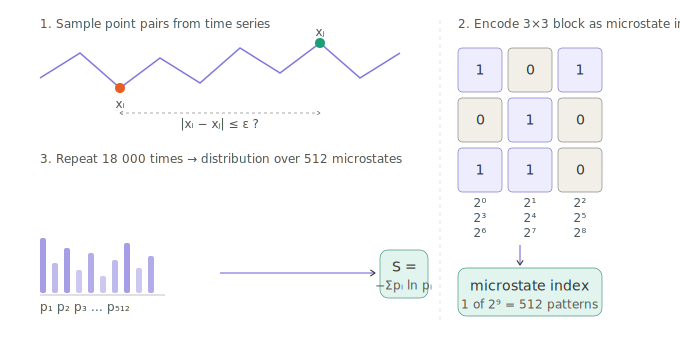
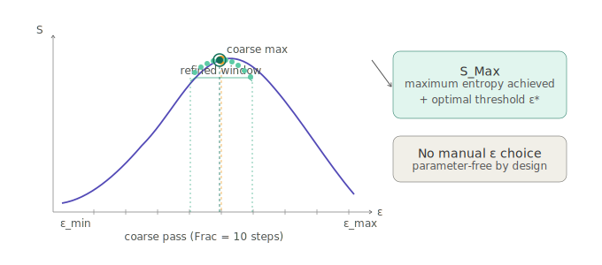

# 🔄 maxEntropy

Julia implementation of **recurrence-matrix entropy** for quantifying the complexity of physiological time series.

[](https://doi.org/10.1063/1.5022154)
[](https://doi.org/10.1371/journal.pone.0298703)
[](https://doi.org/10.17605/OSF.IO/CW87P)
[](./LICENSE)
[](https://julialang.org/)

---

This script implements the maximum-entropy approach to recurrence analysis described in:

> Prado T de L, Dos Santos Lima GZ, Lobão-Soares B, do Nascimento GC, Corso G, Fontenele-Araujo J, et al. (2018).
> Optimizing the detection of nonstationary signals by using recurrence analysis.
> *Chaos*, 28(8): 085703. https://doi.org/10.1063/1.5022154

It was used to produce the entropy estimates reported in:

> Ferré IBS, Corso G, dos Santos Lima GZ, Lopes SR, Leocadio-Miguel MA, França LGS, de Lima Prado T, Araújo JF (2024).
> Cycling reduces the entropy of neuronal activity in the human adult cortex.
> *PLOS ONE*, 19(10): e0298703. https://doi.org/10.1371/journal.pone.0298703

The companion data and analysis code for the PLOS ONE paper are available at
[circadia-bio/cycling-entropy](https://github.com/circadia-bio/cycling-entropy)
and on OSF at https://doi.org/10.17605/OSF.IO/CW87P.

---

## 📖 Method overview

The algorithm estimates entropy from a time series by:

1. Constructing a recurrence matrix — for each pair of points sampled from the series, checking whether they are within a threshold distance `ε`.
2. Encoding local 3×3 blocks of the recurrence matrix as integer *microstates* (one of 2⁹ = 512 possible patterns).
3. Computing the Shannon entropy of the microstate probability distribution.
4. Searching over a range of `ε` values to find the threshold that **maximises** entropy (hence *maxEntropy*) — this is parameter-free in the sense that no threshold needs to be chosen manually.

The search is hierarchical: a coarse pass over the full `ε` range is followed by a finer pass centred on the current maximum, iterating until convergence.

### 🧩 Microstate encoding

Each 3×3 block of the recurrence matrix is read as a 9-bit binary number. A cell is `1` if the two time-series points it represents are within `ε` of each other, `0` otherwise. The resulting integer (0–511) identifies the microstate. After sampling 18 000 random point pairs, the probability distribution over all 512 microstates is used to compute Shannon entropy.



### 🔍 ε search strategy

Rather than requiring the user to pick a threshold, the algorithm scans from `ε_min` to `ε_max` in a coarse pass (`Frac` steps), identifies the region of maximum entropy, then refines iteratively (`Frac2` rounds) within a narrowing window around the current best. The result is the threshold-independent maximum entropy `S_Max` and its associated `ε*`.



---

## ⚙️ Requirements

- [Julia](https://julialang.org/) ≥ 1.6
- Standard library only (`Random`, `DelimitedFiles`) — no additional packages required.

---

## 🚀 Usage

### Input format

The script expects plain-text (space- or tab-delimited) files, one per subject, organised in subdirectories. The naming convention used in the original study was:

```
<SubjectID>/<SubjectID>_POA.txt
```

Each file should contain a matrix where rows are time points and columns are signal channels. The first `r_Ex = 6` rows are skipped (assumed to be a header or pre-stimulus period), and columns 2–10 are processed.

Edit the `VEC_IND` array at the top of `main()` to match your subject identifiers, and adjust `r_Ex`, `all_cols`, `Amp`, and `Window_Size` as needed for your data.

### Running

```bash
julia Entropy.jl
```

### Output

For each subject and each signal column, the script writes a `.dat` file named:

```
Quantifiers_<col>_col_<SubjectID>_POA.dat
```

Each row contains three columns:

| Column | Description |
|--------|-------------|
| 1 | Time (window centre, in seconds at 1 kHz sampling) |
| 2 | Maximum entropy `S_Max` |
| 3 | Threshold `ε` at which `S_Max` was achieved |

---

## 🔧 Key parameters

| Parameter | Default | Description |
|-----------|---------|-------------|
| `StatsBlock` | 3 | Side length of the recurrence microstate block (block is `StatsBlock × StatsBlock`) |
| `Window_Size` | 300 | Number of samples per analysis window |
| `samples` | 18 000 | Number of random point-pairs drawn to estimate the recurrence matrix |
| `Frac` | 10 | Number of `ε` steps in the coarse search pass |
| `Frac2` | 10 | Number of refinement iterations |
| `Amp` | 10 | Downsampling factor applied when extracting each window from the raw series |

---

## 📄 Citation

If you use this code, please cite the original methods paper:

```bibtex
@article{prado2018optimizing,
  title   = {Optimizing the detection of nonstationary signals by using recurrence analysis},
  author  = {Prado, Thiago de Lima and Dos Santos Lima, Gustavo Zampier and
             Lob{\~a}o-Soares, Bruno and do Nascimento, George C and
             Corso, Gilberto and Fontenele-Araujo, John and
             Lopes, Sergio Roberto and Kurths, J{\"u}rgen},
  journal = {Chaos},
  volume  = {28},
  number  = {8},
  pages   = {085703},
  year    = {2018},
  doi     = {10.1063/1.5022154}
}
```

If you use this code in the context of EEG complexity analysis, you may also wish to cite the companion paper:

```bibtex
@article{ferre2024cycling,
  title   = {Cycling reduces the entropy of neuronal activity in the human adult cortex},
  author  = {Ferr{\'e}, Iara Beatriz Silva and Corso, Gilberto and
             dos Santos Lima, Gustavo Zampier and Lopes, Sergio Roberto and
             Leocadio-Miguel, Mario Andr{\'e} and Fran{\c{c}}a, Lucas G S and
             de Lima Prado, Thiago and Ara{\'u}jo, John Fontenele},
  journal = {PLOS ONE},
  volume  = {19},
  number  = {10},
  pages   = {e0298703},
  year    = {2024},
  doi     = {10.1371/journal.pone.0298703}
}
```

---

## 🤝 Related tools

- 🌙 [**SleepDiaries**](https://github.com/circadia-bio/SleepDiaries) — open-source React Native sleep diary app
- ⚡ [**ACTT_validation_study**](https://github.com/circadia-bio/ACTT_validation_study) — ActTrust® device validation pipeline in R/Quarto
- 🌀 [**nonparametric-actigraphy-clustering**](https://github.com/circadia-bio/nonparametric-actigraphy-clustering) — circadian phenotyping from actigraphy
- 🔬 [**circadia-bio**](https://github.com/circadia-bio) — the Circadia Lab GitHub organisation

---

## 📄 Licence

[MIT](LICENSE) © 2024 circadia-bio
